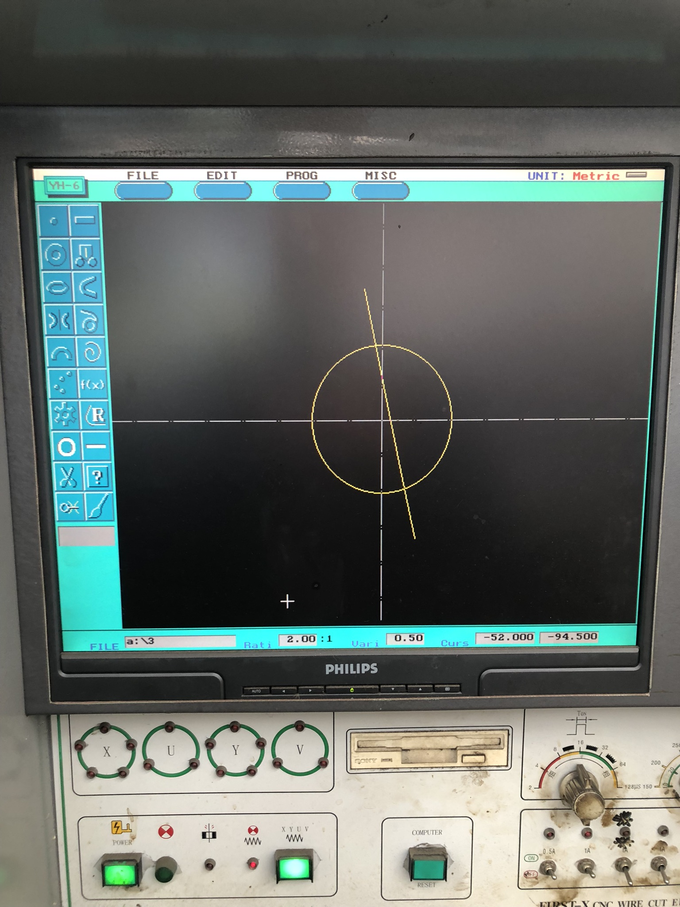
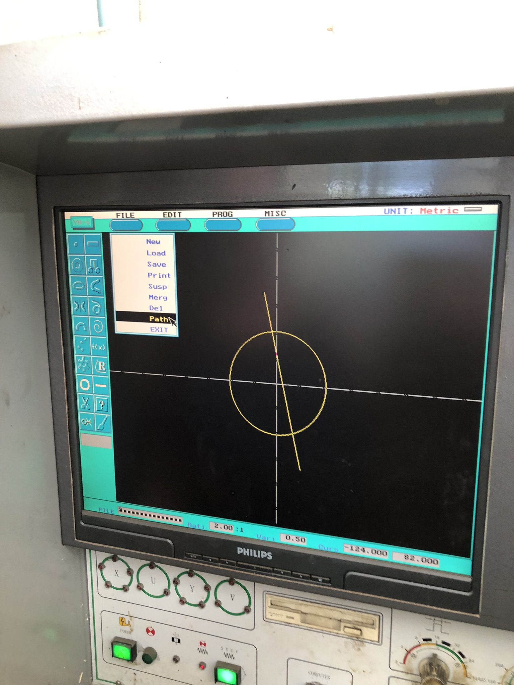
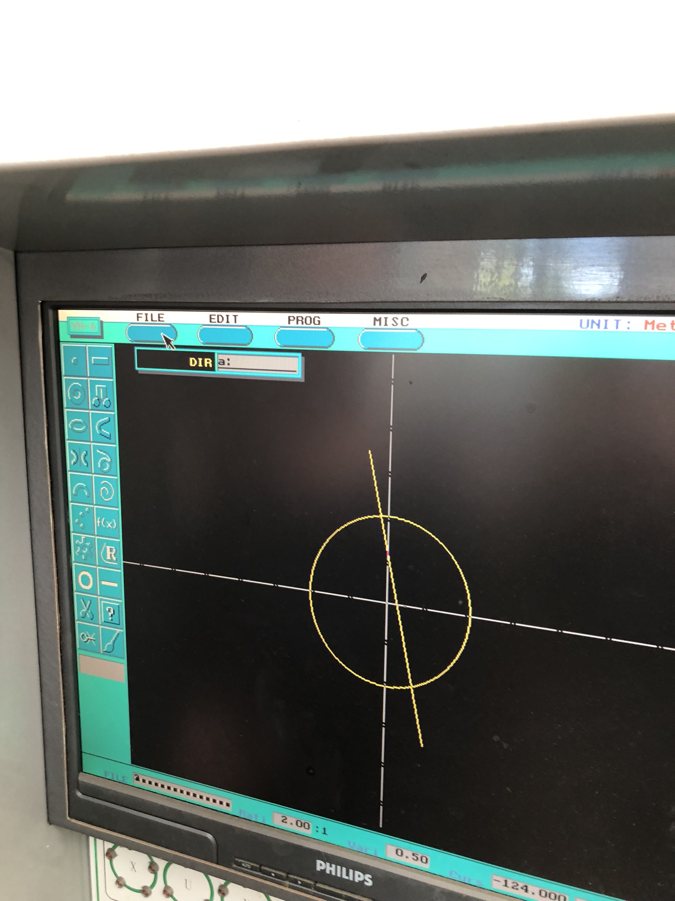
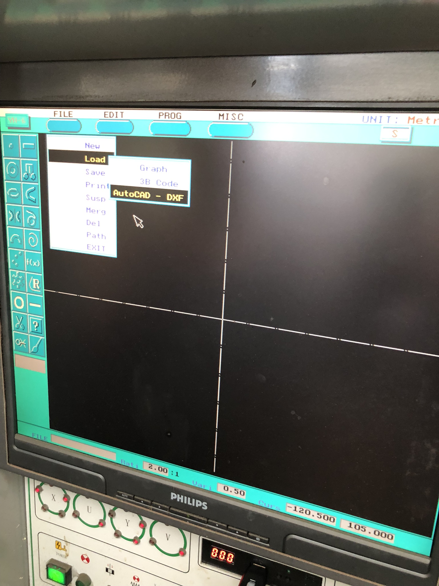
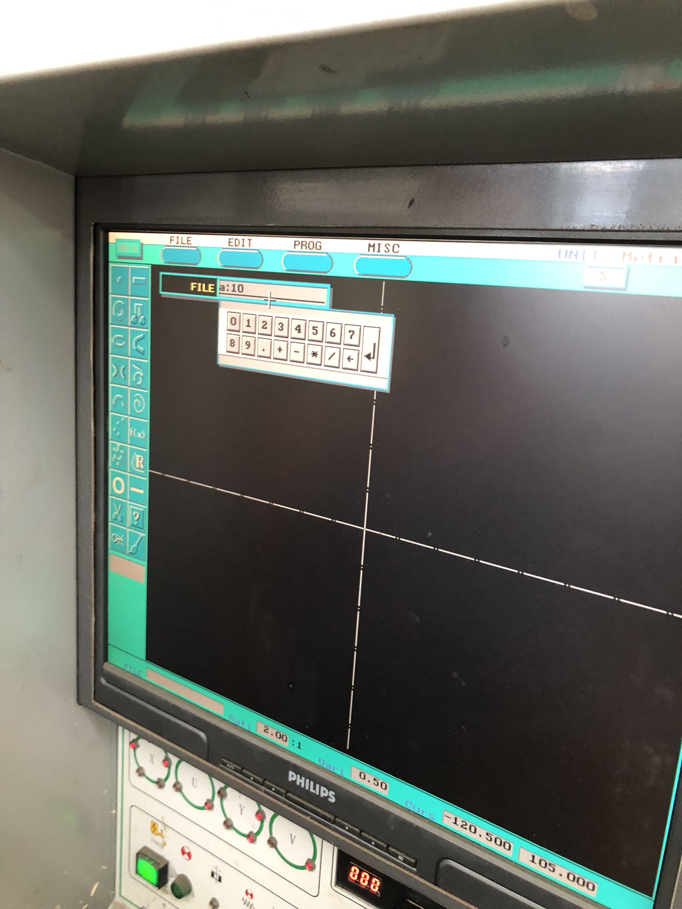

# CNC Reminders

This doc gives simple reminders of workflow using the CNC with USB floppy emulator (in case you have forgotten).

## Opening Files from Floppy Drive

On the bottom left, the "FILE" input box shows "a:\3" for opening file "3" from the floppy drive.

## Setting the Default Path

Sometimes you will want to switch between saving and loading files on the A drive and on the C drive. This is how you change the default drive.

Select menu "FILE" → "Path" ...

... and enter "a:" (case-insensitive) to make the default Load/Save directory to be the root of the floppy disk. Enter "c:" to make it the hard drive.

## Opening DXF Files from Floppy Drive

Select menu "FILE" → "Load" → "AutoCAD - DXF" ...

In the photo example, to load "10.dxf" from the floppy, type "a:10" in the FILE input dialog and then Enter
