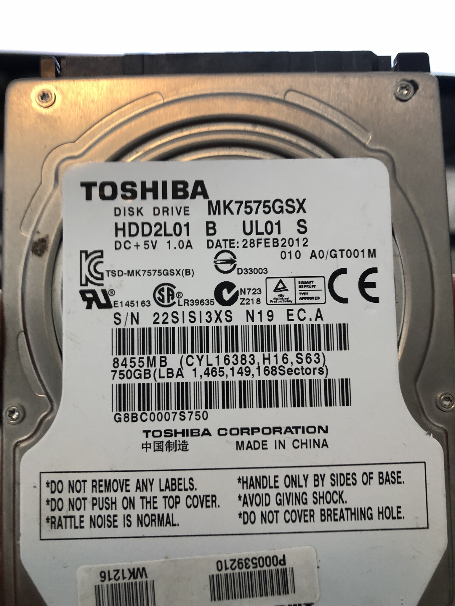
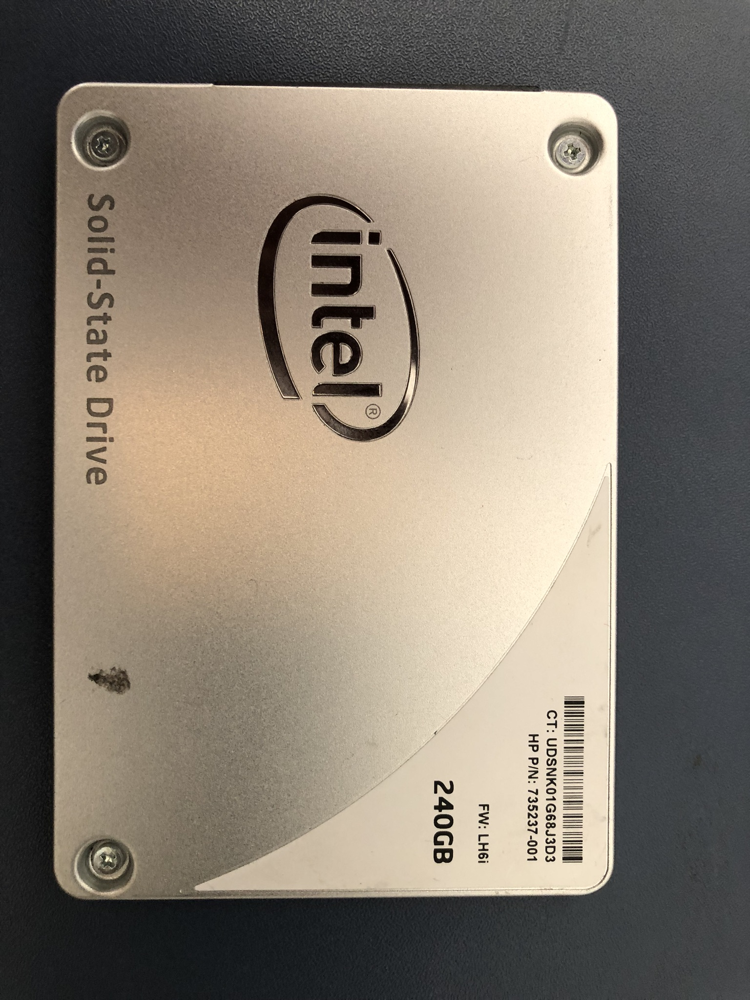

# Hard Drive and CloneZilla Clone Inventory

This document tracks physical hard drives and their CloneZilla backup images.

## Hard Drives

| Name | Image | Description |
|------|-------|-------------|
| Tonys_Toshiba |  | Toshiba hard drive put into Tony's HP EliteBook laptop |
| Tonys_Backup |  | Currently contains CloneZilla images of hard drives  <pre> Volume in drive D is DataSSD  Volume Serial Number is 7C45-F11F   Directory of D:\  28/01/2026  02:40 pm    &lt;DIR&gt;          2025-12-19-1550-img-rescuezilla 29/01/2026  06:16 am    &lt;DIR&gt;          2026-01-26-2126-img-rescuezilla 28/01/2026  01:57 pm    &lt;DIR&gt;          2026-01-27-1512-img-rescuezilla                0 File(s)              0 bytes                3 Dir(s)  155,355,873,280 bytes free</pre> |

## CloneZilla Hard Drive Clones

| Name | Description | Location |
|------|-------------|----------|
| 2026-01-26-2126-img-rescuezilla | 750Gb disk with Windows XP 32 bit and I-DEAS10 (base setup for the HP EliteBook) | Tonys_Backup, [MEGA.nz](https://mega.nz/) |
| 2025-12-19-1550-img-rescuezilla | Tony's desktop backup | Tonys_Backup |
| 2026-01-27-1512-img-rescuezilla | Backup of original Windows 7 HP EliteBook 240Gb hard drive | Tonys_Backup |
