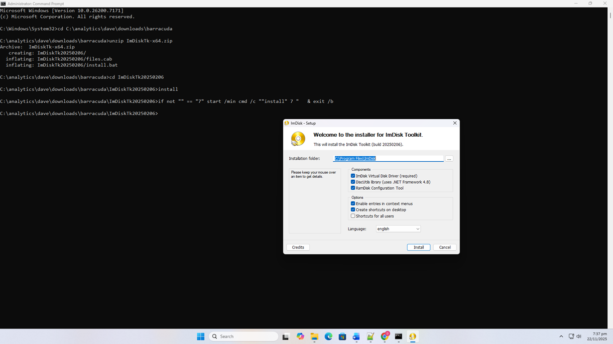
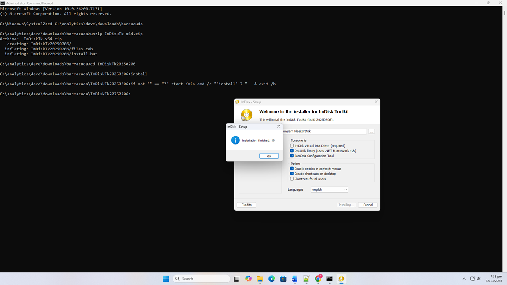

# ImDisk Reminders

ImDisk is a Windows application that has a useful command line tool and Windows service for "mounting" floppy disk images. It can be installed on Windows XP SP3 and later. We use it in the VBScript tool `edit_floppy_usb.vbs`. 

## Download Links

The home page for ImDisk is:
http://www.ltr-data.se/opencode.html/#ImDisk 

This page has a link to SourceForge for downloading the installers:
https://sourceforge.net/projects/imdisk-toolkit/files/20240113/ 

## Installation

After downloading, it can be installed from a Command Prompt in Administrator mode using the following command-line example (see also images below):

```
C:\Windows\System32>cd C:\analytics\dave\downloads\barracuda
C:\analytics\dave\downloads\barracuda>unzip ImDiskTk-x64.zip
Archive:  ImDiskTk-x64.zip
   creating: ImDiskTk20250206/
  inflating: ImDiskTk20250206/files.cab
  inflating: ImDiskTk20250206/install.bat
C:\analytics\dave\downloads\barracuda>cd ImDiskTk20250206
C:\analytics\dave\downloads\barracuda\ImDiskTk20250206>install
```



Before install



After install
