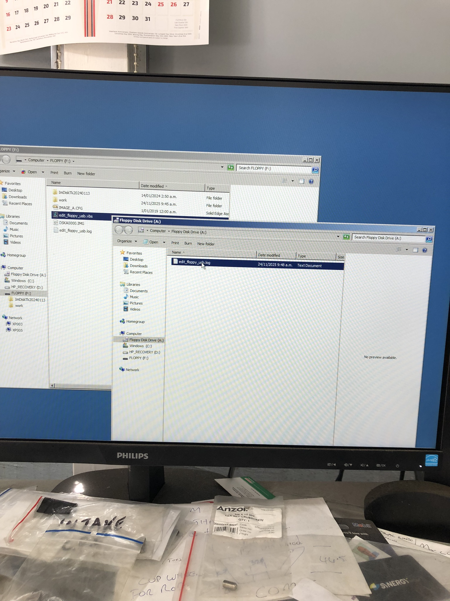
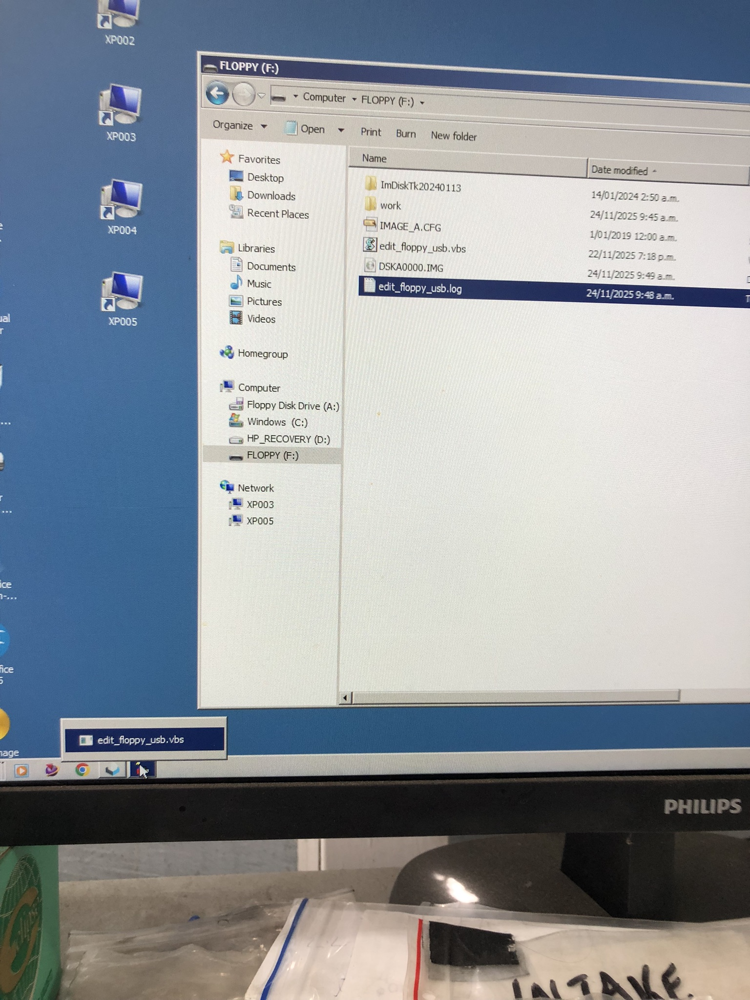
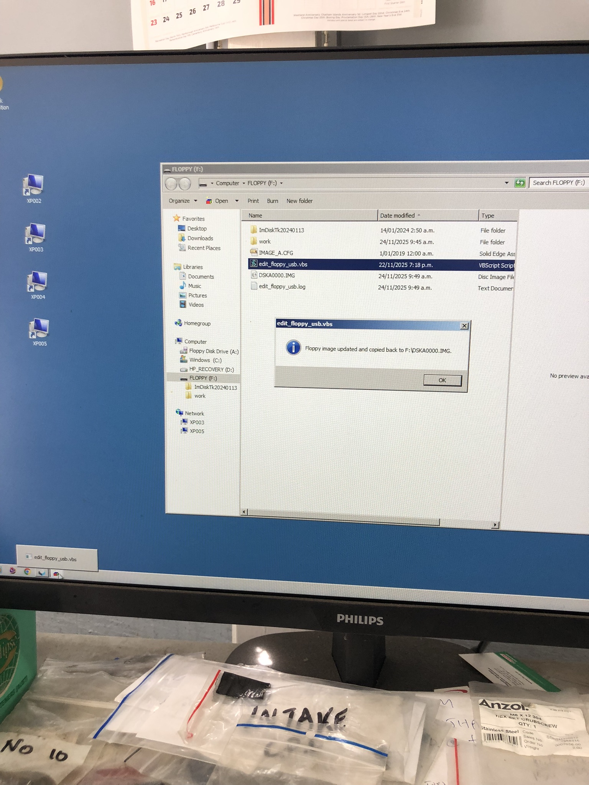

# USB Floppy Disk Reminders

This doc gives simple reminders of workflow using the CNC with USB floppy emulator (in case you have forgotten).

## Editing the Virtual Floppy Disk

Open the USB and double-click `edit_floppy_usb.vbs` to open a "File Explorer" (the new name for "Windows Explorer") to edit the contents of the "virtual" floppy disk. In this case, the File Explorer in the foreground, with title "Floppy Disk Drive (A:)", shows that the "virtual" floppy disk currently contains a file called "edit_floppy_usb.log". The content of "virtual" floppy disk is stored in the file `DSKA0000.IMG` you can see in the background on the USB. Manage the content of the "virtual" floppy disk by copying, cutting, pasting and deleting files and folders to and from this File Explorer, as you normally would.

## Closing the File Explorer

**IMPORTANT**: Close the File Explorer "Floppy Disk Drive (A:)" to trigger the update of the `DSKA0000.IMG` file that stores the "virtual" floppy disk content.

In the bottom left on the screen you can see a little icon with name "edit_floppy_usb.vbs". Click the button to show the next screenshot.

## Confirmation

Click OK to close the message box telling you the update was successful: "Floppy image updated and copied back to F:\\ DSKA0000.IMG"
